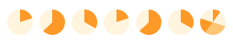
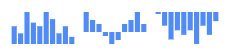
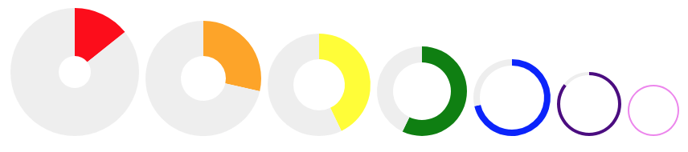
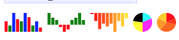

# Peity Vanilla JS

Converts an element's content into a `<svg>` mini pie  donut  line  or bar chart  and is compatible with any browser that supports `<svg>`: Chrome, Firefox, IE9+, Opera, Safari.

PS: 98% based on the original implementation: http://benpickles.github.io/peity/. 

## Instalation

Just download `peity_vanilla.js` and add to your HTML file.

```html
<script type="text/javascript" src="peity_vanilla.js"></script>
```

And start using :)

## Pie Charts



```html
<span class="pie">1/5</span>
<span class="pie">226/360</span>
<span class="pie">0.52/1.561</span>
<span class="pie">1,4</span>
<span class="pie">226,134</span>
<span class="pie">0.52,1.041</span>
<span class="pie">1,2,3,2,2</span>

<script>
  document.querySelectorAll(".pie").forEach(e => peity(e, "pie"))
</script>
```

There are two subtly different pie chart semantics, a "/" delimiter is assumed to mean "three out of five" and only the first two values will be drawn, otherwise all of the values are included in the chart and the total is the sum of all values.

You can also pass delimiter, fill, height, radius and width options. Passing a radius will set the correct width and height, the pie will always be a circle that fits the available space.

## Donut Charts


```html
<span class="donut">1/5</span>
<span class="donut">226/360</span>
<span class="donut">0.52/1.561</span>
<span class="donut">1,4</span>
<span class="donut">226,134</span>
<span class="donut">0.52,1.041</span>
<span class="donut">1,2,3,2,2</span>

<script>
  document.querySelectorAll(".donut").forEach(e => peity(e, "donut"))
</script>
```

Donut charts are the same as pie charts and take the same options with an added innerRadius option which defaults to half the radius.

## Line Charts


```html
<span class="line">5,3,9,6,5,9,7,3,5,2</span>
<span class="line">5,3,2,-1,-3,-2,2,3,5,2</span>
<span class="line">0,-3,-6,-4,-5,-4,-7,-3,-5,-2</span>

<script>
  document.querySelectorAll(".line").forEach(e => peity(e, "line"))
</script>
```

Line charts work on a comma-separated list of digits. Line charts can take the following options: delimiter, fill, height, max, min, stroke, strokeWidth and width.

## Bar Charts




```html
<span class="bar">5,3,9,6,5,9,7,3,5,2</span>
<span class="bar">5,3,2,-1,-3,-2,2,3,5,2</span>
<span class="bar">0,-3,-6,-4,-5,-4,-7,-3,-5,-2</span>

<script>
  document.querySelectorAll(".bar").forEach(e => peity(e, "bar"))
</script>
```

Bar charts work in the same way as line charts and take the following options: `delimiter, fill, height, max, min, padding and width`.

## data-* attributes



Data attributes can be used to pass custom settings per-chart - options explicitly passed to the peity() function take precedence over data-* attributes.

```html
<p class="data-attributes">
  <span data-peity='{ "fill": ["red", "#eeeeee"],    "innerRadius": 10, "radius": 40 }'>1/7</span>
  <span data-peity='{ "fill": ["orange", "#eeeeee"], "innerRadius": 14, "radius": 36 }'>2/7</span>
  <span data-peity='{ "fill": ["yellow", "#eeeeee"], "innerRadius": 16, "radius": 32 }'>3/7</span>
  <span data-peity='{ "fill": ["green", "#eeeeee"],  "innerRadius": 18, "radius": 28 }'>4/7</span>
  <span data-peity='{ "fill": ["blue", "#eeeeee"],   "innerRadius": 20, "radius": 24 }'>5/7</span>
  <span data-peity='{ "fill": ["indigo", "#eeeeee"], "innerRadius": 18, "radius": 20 }'>6/7</span>
  <span data-peity='{ "fill": ["violet", "#eeeeee"], "innerRadius": 15, "radius": 16 }'>7/7</span>
</p>

<script>
  document.querySelectorAll(".data-attributes span").forEach(e => peity(e, "donut"))
</script>
```

## Setting Colours Dynamically




```html
<span class="bar-colours-1">5,3,9,6,5,9,7,3,5,2</span>
<span class="bar-colours-2">5,3,2,-1,-3,-2,2,3,5,2</span>
<span class="bar-colours-3">0,-3,-6,-4,-5,-4,-7,-3,-5,-2</span>
<span class="pie-colours-1">4,7,6,5</span>
<span class="pie-colours-2">5,3,9,6,5</span>

<script>
  document.querySelectorAll(".bar-colours-1").forEach(e => peity(e, "bar", {
    fill: ["red", "green", "blue"]
  }))

  document.querySelectorAll(".bar-colours-2").forEach(e => peity(e, "bar", {
    fill: function(value) {
      return value > 0 ? "green" : "red"
    }
  }))

  document.querySelectorAll(".bar-colours-3").forEach(e => peity(e, "bar", {
    fill: function(_, i, all) {
      var g = parseInt((i / all.length) * 255)
      return "rgb(255, " + g + ", 0)"
    }
  }))
  
  document.querySelectorAll(".pie-colours-1").forEach(e => peity(e, "bar", {
    fill: ["cyan", "magenta", "yellow", "black"]
  }))

  document.querySelectorAll(".pie-colours-2").forEach(e => peity(e, "bar", {
    fill: function(_, i, all) {
      var g = parseInt((i / all.length) * 255)
      return "rgb(255, " + g + ", 0)"
    }
  }))
</script>
```

Pie, donut and bar chart colours can be defined dynamically based on the values of the chart. When passing an array its values are cycled, when passing a function it is called once for each value allowing you to define each bar or segment's colour. The callback is invoked with the value, its index, and the full array of values - the same arguments as the callback for Array#forEach.

## Updating Charts


Charts can be updated by changing the selection's text content and calling change() on it. The chart will be redrawn with the same options that were originally passed to it.

```html
<span class="updating-chart">5,3,9,6,5,9,7,3,5,2,5,3,9,6,5,9,7,3,5,2</span>

<script>
  var updatingChart = peity(document.getElementById("updating-chart"), "line", { width: 64 });
  
  setInterval(function() {
    var random = Math.round(Math.random() * 10)
    // debugger
    var values = updatingChart.innerText.split(",")
    values.shift()
    values.push(random)

    updatingChart.innerText = values.join(",")
    updatingChart.dispatchEvent(new Event('change'))
  }, 1000);
</script>
```

## Default Settings

```html
<script>
  peity.defaults.pie = {
    delimiter: null,
    fill: ["#58508d", "#ffa600", "#ff6361"],
    height: null,
    radius: 8,
    width: null
  }

  peity.defaults.donut = {
    delimiter: null,
    fill: ["#ff9900", "#fff4dd", "#ffd592"],
    height: null,
    innerRadius: null,
    radius: 8,
    width: null
  }

  peity.defaults.line = {
    delimiter: ",",
    fill: "#fff4dd",
    height: 16,
    max: null,
    min: 0,
    stroke: "#ffa600",
    strokeWidth: 1,
    width: 32
  }

  peity.defaults.bar = {
    delimiter: ",",
    fill: ["#4d89f9"],
    height: 16,
    max: null,
    min: 0,
    padding: 0.1,
    width: 32
  } 
</script>
```

# Future

Please if you want to contribute here is a list with some ideas:

- version for react, angular, vue, ...
- unit tests
- tooltips
- more chart types (stacked, multi-line, etc)
- more options for existing charts
- minified version
- build process and instructions
- remote datasource

# Build Process

`yarn build` - production.

`yarn start` - development, and open http://0.0.0.0:8080/

# Credits

Thanks for inspiration and original jQuery implementation - http://benpickles.github.io/peity/. I must admit this version is 98% consist of the original code, even the documentation, so please go to original page and put a "star" to original repo.
